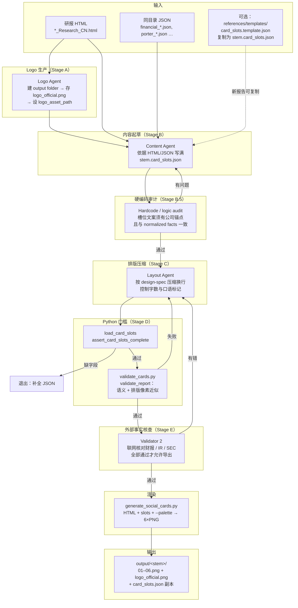
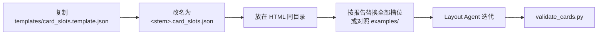
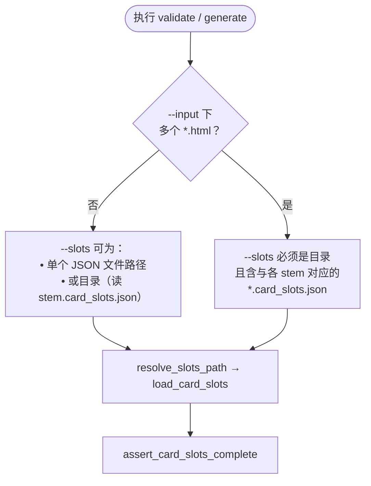
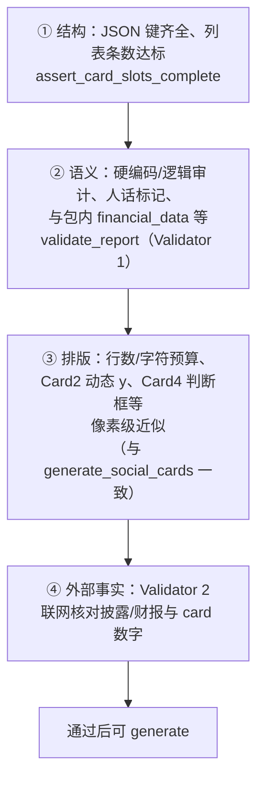

# Equity Photo Skill — 流程图（审阅版）

与 [SKILL.md](../SKILL.md)、[workflow-spec.md](./workflow-spec.md) 一致；在支持 Mermaid 的编辑器或 GitHub 中预览。

---

## 0. Skill 目录 bundle（skill-creator anatomy）

| 路径 | 职责 |
|------|------|
| `SKILL.md` | 模型入口：原则、步骤、链接（正文保持精简） |
| `agents/` | 子 Agent 说明：内容生产 → 排版填充 → 硬编码/逻辑审计 → 校验策略 |
| `references/` | 规格、设计、Schema、**示例**、**新报告模版**、**本文流程图** |
| `scripts/` | `validate_cards.py`、`generate_social_cards.py`（确定性渲染与校验） |
| `evals/` | 可选回归提示 `evals.json` |
| `output/` | 默认 PNG 输出目录（`.gitignore`；可用 `--output-root` 改） |

---

## 1. 端到端总览（唯一出图路径）

**硬性规则：** `--slots` 必填；`load_card_slots` → `assert_card_slots_complete`；无「不写 slots 纯启发式出图」路径。

---

## 2. 新报告如何得到 `card_slots.json`

---

## 3. `--slots` 路径解析（CLI）

---

## 4. 校验分层（为何稳定）

---

## 5. 与 workflow-spec 步骤对应（含配色确认与 Validator 2）

```mermaid
flowchart LR
    S0["0 配色确认\nclient: default|b|c"] --> SA["1 Logo 生产\n建 output folder\n存 logo_official.png"]
    SA --> S1["2 ingest"]
    S1 --> S2["3 extract"]
    S2 --> S3["4 normalize"]
    S3 --> S4["5 plan slots"]
    S4 --> S5["6 write JSON\nContent Agent (Stage B)"]
    S5 --> S6["7 Hardcode 审计\nStage B.5"]
    S6 -->|有问题| S5
    S6 -->|通过| S7["8 Layout Agent\nStage C"]
    S7 --> S8["9 Validator 1\nvalidate_cards --slots"]
    S8 -->|失败| S7
    S8 -->|通过| S9["10 Validator 2\n联网事实核查"]
    S9 -->|有错| S7
    S9 -->|通过| S10["11 export\n--slots --palette <confirmed>"]
```

详述与必填槽位列表见 [workflow-spec.md §10](./workflow-spec.md)。
