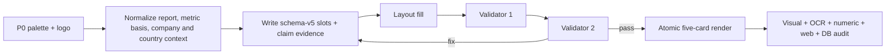

# Five-card workflow

```mermaid
flowchart LR
    P0["P0 palette + logo"] --> N["Normalize report, metric basis, company and country context"]
    N --> C["Write schema-v5 slots + claim evidence"]
    C --> L["Layout fill"]
    L --> V1["Validator 1"]
    V1 --> V2["Validator 2"]
    V2 -->|"fix"| C
    V2 -->|"pass"| R["Atomic five-card render"]
    R --> Q["Visual + OCR + numeric + web + DB audit"]
```

Output: `01_cover`, `02_porter`, `03_five_year_financials`, `04_company_quality`, `05_country_lens`.
